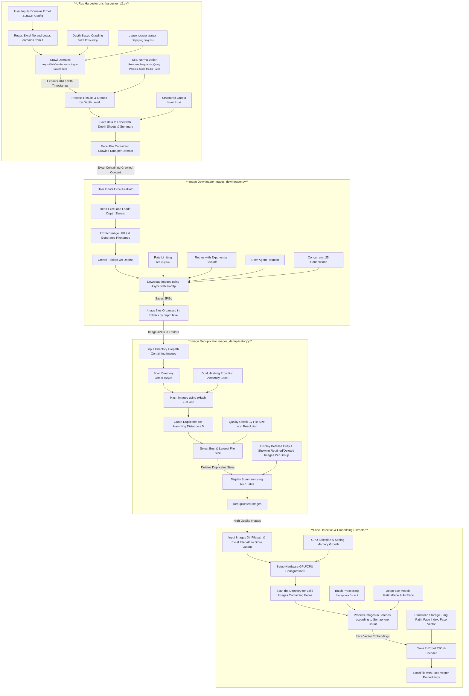

<h1 align="center">🕸️ Deep Web Crawler & Content Extractor</h1>

<div align="center">


**A tool for deep web crawling, content extraction (page URLs / image URLs), image processing (high quality size retention & duplicates removal), facial detection / face vector embeddings extraction**

</div>

---

## 📋 Overview



-  **Web Crawling**: Extrac Images URLs along with Page Source URLs from target domains
-  **Image Acquisition**: Download discovered images
-  **Image Optimization**: Remove duplicates sizes, keep highest quality
-  **Face Analysis**: Detect faces and extract face vector embeddings
-  **Data Export**: Store results for further processing

---

## ✨ Features

<summary><b>Core Capabilities</b></summary>

- 🌐 **Multi-domain deep crawling** with configurable depth levels
- 📊 **Intelligent data extraction** with comprehensive metadata
- 🖼️ **Automated image processing pipeline** with deduplication
- 👤 **Advanced facial recognition** using deep learning
- 📈 **Face Vector embedding extraction** for ML applications

---

## 🔧 Installation

<details>
<summary><b>Environment Setup</b></summary>

```bash
# create and activate virtual environment (recommended)
python -m venv venv

# on Windows: venv\Scripts\activate
source venv/bin/activate

# install required packages
pip install -r requirements.txt
```
</details>

<details>
<summary><b>Requirements</b></summary>

```
crawl4ai
aiohttp
aiofiles
pandas
openpyxl
tldextract
rich
nest_asyncio
aiolimiter
tqdm
Pillow
imagehash
tensorflow>=2.10.0
deepface
```
</details>

<details>
<summary><b>Project Structure</b></summary>

```
MEDIA_EXTRACTION_WEB_CRAWLER/
├── urls_harvester_v2.py                   # Web crawler
├── images_downloader.py                   # Image downloader
├── images_deduplicator.py                 # Image deduplication
├── face_vector_embeddings_extractor       # Face analysis
├── config.json                            # Browser & Crawl Configuration
├── domains.xlsx                           # Input domains
├── user-agents.txt                        # User agent list
├── crawled_sites_data.xlsx                # Output file Containing Crawled Content
└── Downloaded_Images/                     # Output directory for downlaoded images data
```
</details>

---

## 🧩 Components

### 🌐 URL Harvester

<details>
<summary><b>Description & Features</b></summary>

<br>

**Purpose**: Crawl websites to extract URLs and image locations with their source pages.

#### Key Features:
- 🌐 Multi-domain crawling support
- 📊 Depth-wise crawling with configurable limits
- 🎯 Smart URL filtering and normalization
- 🔄 Adaptive rate limiting and memory management
- 📝 Detailed Excel reports with depth-wise organization
- 🖼️ Image URL extraction with source page tracking
- ⚡ Asynchronous processing for improved performance
- 🎛️ Configurable browser and crawler settings

#### Output:
- Excel file with sheets for each depth level
- Image URLs mapped to their source pages
- Detailed statistics and summaries

</details>

<details>
<summary><b>Usage</b></summary>

```bash
python urls_harvester_v2.py
```

You'll be prompted to:
1. Enter path to domains Excel file
2. Select domains to process
3. Provide path to config JSON file
4. Specify maximum crawl depth
5. Set URL limits for each depth level

Configuration (`config.json`):
```json
{
    "browser_config": {
        "browser_type": "chromium",
        "channel": "chrome",
        "headless": true,
        "user_agent_mode": "random",
        "ignore_https_errors": true,
        "verbose": false,
        "extra_args": [
            "--disable-gpu",
            "--no-sandbox",
            "--disable-dev-shm-usage",
            "--disable-extensions",
            "--disable-background-networking",
            "--disable-sync",
            "--disable-translate",  
            "--disable-infobars",
            "--disable-notifications",
            "--mute-audio"
          ]
    },
    "crawler_config": {
        "mean_delay": 0.1,
        "max_range": 0.3,
        "page_timeout": 30000,
        "scan_full_page": true,
        "scroll_delay": 0.5,
        "wait_for_images": true,
        "remove_overlay_elements": true,
        "exclude_external_links": true,
        "exclude_social_media_links": true, 
        "delay_before_return_html": 10,
        "cache_mode": "ENABLED",
        "simulate_user": true,
        "override_navigator": true
    },
    "other_config": {
        "depth_wise_url_batch_size": 500
    }
} 
```
</details>

### 📥 Image Downloader

<details>
<summary><b>Description & Features</b></summary>

<br>

**Purpose**: Download images from URLs extracted by the harvester.

#### Key Features:
- ⚡ Asynchronous Batch downloading with connection pooling
- 🔄 Rotating user agents for better reliability
- ⏱️ Smart rate limiting (Configurable e.g, 600 requests/minute)
- 🔁 Automatic retries with exponential backoff
- 📊 Progress tracking with detailed statistics
- 📁 Organized folder structure by depth level

#### Output:
- Structured folders organizing images by depth level
- Intelligently named files with depth and row information

</details>

<details>
<summary><b>Usage</b></summary>

```bash
python images_downloader.py
```

You'll be prompted to provide the path to the Excel file generated by the URL harvester. The script will:
1. Create organized folders by depth level
2. Download images with structured naming conventions
3. Handle rate limiting and retries automatically
4. Show detailed progress statistics
</details>

### 🖼️ Image Deduplicator

<details>
<summary><b>Description & Features</b></summary>

<br>

**Purpose**: Remove duplicate images and keep only the highest quality version.

#### Key Features:
- 🧮 Perceptual hash (pHash) and average hash (aHash) comparison
- 🎚️ Configurable similarity threshold
- 📏 Automatic retention of highest resolution duplicates
- 📊 Detailed reporting of deduplication process with rich console output
- 🖼️ Support for PNG, JPG, and JPEG formats

#### Process:
1. Generate hashes for all images
2. Group similar images based on hash similarity
3. Evaluate quality metrics (size, dimensions)
4. Keep highest quality version and remove duplicates
5. Generate detailed report of actions taken

</details>

<details>
<summary><b>Usage</b></summary>

```bash
# Import the module
from images_deduplicator import process_images

# Process images in a specific directory
process_images("Downloaded_Images/Depth Level 0", similarity_threshold=5)
```

Parameters:
- `image_dir`: Directory containing images to process
- `similarity_threshold`: Maximum allowed Hamming distance (default: 5)
  - Lower values = stricter matching
  - Higher values = more permissive matching

Output example:
```
┏━━━━━━━━━━━━━━━━━━━━━━━━━━━━━━━━━━━━━━┓
┃          Detailed Summary Table       ┃
┗━━━━━━━━━━━━━━━━━━━━━━━━━━━━━━━━━━━━━━┛
                 Group                 
┏━━━━━━━┳━━━━━━━━━━━━━━━━━━━━━━━━━━━━━━━━━━━━━━━━━━┳━━━━━━━━━━━━┳━━━━━━━━━━━━┳━━━━━━━━━━━━━━━━━┓
┃ No.   ┃ Image                                    ┃   Action   ┃  Size (KB) ┃   Dimensions    ┃
┡━━━━━━━╇━━━━━━━━━━━━━━━━━━━━━━━━━━━━━━━━━━━━━━━━━━╇━━━━━━━━━━━━╇━━━━━━━━━━━━╇━━━━━━━━━━━━━━━━━┩
│ 1     │ 90_d0.jpg                                │ ✓ Retained │      58.84 │     770x513     │
│ 2     │ 91_d0.jpg                                │ ✗ Deleted  │       3.17 │     140x93      │
│ 3     │ 92_d0.jpg                                │ ✗ Deleted  │       4.27 │     170x113     │
│ 4     │ 93_d0.jpg                                │ ✗ Deleted  │       8.69 │     270x180     │
│ 5     │ 94_d0.jpg                                │ ✗ Deleted  │      15.33 │     375x250     │
│ 6     │ 95_d0.jpg                                │ ✗ Deleted  │      32.92 │     570x380     │
└───────┴──────────────────────────────────────────┴────────────┴────────────┴─────────────────┘
```
</details>

<details>
<summary><b>Adjusting Deduplication Sensitivity</b></summary>

<br>

The similarity threshold determines how aggressive the deduplication will be:

- **Strict (1-3)**: Only nearly identical images will be grouped
- **Moderate (4-8)**: Default range, balances precision with recall
- **Lenient (9+)**: More aggressive grouping, may consolidate visually different images
  
</details>

### 👤 Face Detection & Embedding Extractor

<details>
<summary><b>Description & Features</b></summary>

<br>

**Purpose**: Detect faces in images and extract vector embeddings for recognition and analysis.

#### Key Features:
- 🧠 Deep learning-based face detection using RetinaFace
- 🔍 ArcFace model for high-quality face embeddings
- 🚀 GPU acceleration support with automatic detection
- ⚡ Asynchronous batch processing for performance
- 📊 Detailed logging and progress reporting

#### Technical Details:
- Uses DeepFace framework with TensorFlow backend
- RetinaFace for accurate face detection
- ArcFace for state-of-the-art face embeddings
- Face alignment for better recognition accuracy
- Optional GPU acceleration for faster processing

</details>

<details>
<summary><b>Usage</b></summary>

```bash
python face_detection_and_vector_embeddings_extractor.py input_directory output.csv --batch_size 5
```

Arguments:
- `input_directory`: Folder containing processed images
- `output.csv`: Path to save the embeddings CSV file
- `--batch_size`: Number of concurrent image processing tasks (default: 5)

The script will:
1. Check for GPU availability and configure hardware
2. Process all images in the input directory
3. Detect faces and extract embeddings
4. Save results to a CSV file

The output CSV contains:
- `image_path`: Path to the source image
- `face_index`: Index of the face in the image
- `embedding`: Vector embedding for the face (JSON array)
</details>

---

## 🛠️ Best Practices

<summary><b>Performance Optimization</b></summary>

1. **Crawling Strategy**
   - Start with small depth (1-2) for initial tests
   - Use URL limits per depth for large sites
   - Consider time-of-day for crawling to minimize impact

2. **Resource Management**
   - Monitor system memory during large crawls
   - Use batch processing for large image collections
   - Consider distributed processing for very large datasets

3. **Image Processing**
   - Run deduplication before face detection
   - Use SSD for faster image processing
   - Adjust batch size based on available CPU/RAM

4. **GPU Acceleration**
   - For large image sets, use GPU for face detection
   - Consider reducing batch size if GPU memory is limited
   - Monitor GPU temperature during extended processing
     
---

## 📝 License & Disclaimer

<details>
<summary><b>License Information</b></summary>

This project is licensed under the MIT License.

Copyright (c) 2023

Permission is hereby granted, free of charge, to any person obtaining a copy
of this software and associated documentation files (the "Software"), to deal
in the Software without restriction, including without limitation the rights
to use, copy, modify, merge, publish, distribute, sublicense, and/or sell
copies of the Software, and to permit persons to whom the Software is
furnished to do so, subject to the following conditions:

The above copyright notice and this permission notice shall be included in all
copies or substantial portions of the Software.

THE SOFTWARE IS PROVIDED "AS IS", WITHOUT WARRANTY OF ANY KIND, EXPRESS OR
IMPLIED, INCLUDING BUT NOT LIMITED TO THE WARRANTIES OF MERCHANTABILITY,
FITNESS FOR A PARTICULAR PURPOSE AND NONINFRINGEMENT. IN NO EVENT SHALL THE
AUTHORS OR COPYRIGHT HOLDERS BE LIABLE FOR ANY CLAIM, DAMAGES OR OTHER
LIABILITY, WHETHER IN AN ACTION OF CONTRACT, TORT OR OTHERWISE, ARISING FROM,
OUT OF OR IN CONNECTION WITH THE SOFTWARE OR THE USE OR OTHER DEALINGS IN THE
SOFTWARE.
</details>

<details>
<summary><b>Disclaimer</b></summary>

This software is provided for educational and research purposes only. The author(s) and contributor(s) are not responsible for any misuse of this software.

Users of this software are responsible for using it in accordance with applicable laws and regulations, including but not limited to:

1. Respecting website terms of service
2. Adhering to rate limits and robots.txt directives
3. Complying with data protection and privacy laws
4. Obtaining proper permission for data collection and use

The facial recognition capabilities should be used responsibly and with consideration for privacy and ethical implications.
</details>

---

<div align="center">
    <p>Open an issue on the GitHub repository or submit a pull request with your contribution.</p>
</div>

---

## 📚 Further Reading

<details>
<summary><b>Related Technologies</b></summary>

- [DeepFace Framework](https://github.com/serengil/deepface) - Face recognition library
- [TensorFlow](https://www.tensorflow.org/) - Machine learning framework
- [ArcFace](https://arxiv.org/abs/1801.07698) - Additive Angular Margin Loss for Deep Face Recognition
- [RetinaFace](https://arxiv.org/abs/1905.00641) - Single-stage Dense Face Localisation
- [Perceptual Hashing](https://www.hackerfactor.com/blog/index.php?/archives/432-Looks-Like-It.html) - Image similarity detection

</details>

<details>
<summary><b>Academic References</b></summary>

- Deng, J., Guo, J., Xue, N., & Zafeiriou, S. (2019). ArcFace: Additive Angular Margin Loss for Deep Face Recognition. *IEEE Conference on Computer Vision and Pattern Recognition (CVPR)*.
- Yang, S., Luo, P., Loy, C. C., & Tang, X. (2016). WIDER FACE: A Face Detection Benchmark. *IEEE Conference on Computer Vision and Pattern Recognition (CVPR)*.
- Deng, J., Guo, J., Zhou, Y., Yu, J., Kotsia, I., & Zafeiriou, S. (2019). RetinaFace: Single-stage Dense Face Localisation in the Wild. *arXiv preprint arXiv:1905.00641*.
- Serengil, S. I., & Ozpinar, A. (2020). LightFace: A Hybrid Deep Face Recognition Framework. *IEEE Access*.

</details>

---

<div align="center">
    <p><b>🌟 Star this repository if you find it useful! 🌟</b></p>
    <p>Created with ❤️ by the Team</p>
</div>

